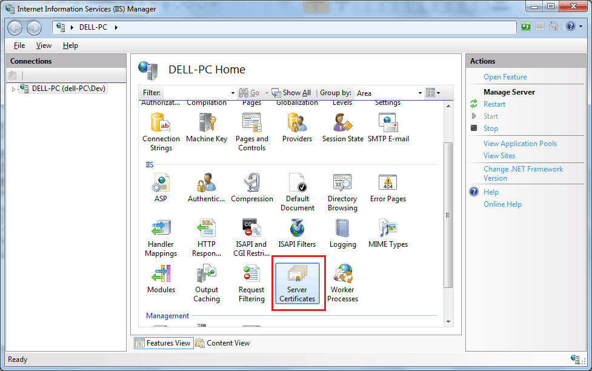
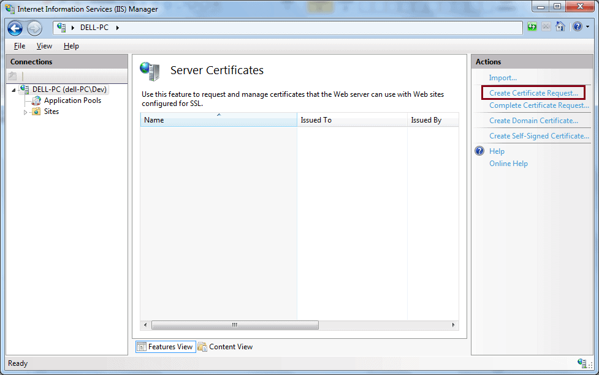
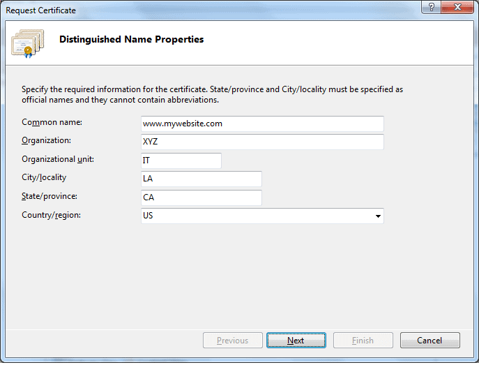
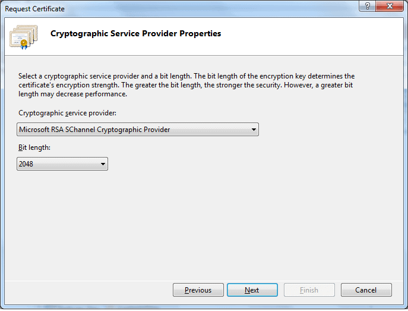
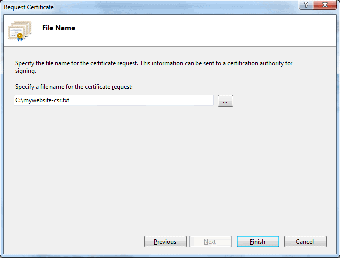

# **Certificate Signing Request**

In order to get an SSL certificate for your website, you need to generate and submit a Certificate Signing Request (CSR) to the CA (Certificate Authority).

## **What is a CSR?**

A CSR is an encoded message submitted by an applicant to a CA to get an SSL certificate. In other words, it is a request from an applicant to a CA to get a digital certificate.

A CSR contains a public key and the applicant's information such as FQDN (Fully Qualified Domain Name), organization name and address. The CA validates the applicant's information and issues an SSL certificate with the public key included in the CSR.

Generally, a CSR is generated using the web server where the SSL certificate is going to be installed. However, it can also be generated using SSL tools or a modern browser such as Chrome or Firefox. The most common format for CSRs is the[ PKCS #10 specification](https://en.wikipedia.org/wiki/PKCS).

A CSR is a Base64 ASCII encoding message starting with "-----BEGIN NEW CERTIFICATE REQUEST-----" and ending with "-----END NEW CERTIFICATE REQUEST-----". The following is a sample CSR:

    -----BEGIN NEW CERTIFICATE REQUEST-----

    MIIERzCCAy8CAQAwZzELMAkGA1UEBhMCVVMxCzAJBgNVBAgMAk5ZMREwDwYDVQQH

    DAhuZXcgeW9yazEPMA0GA1UECgwGbXkgb3JnMQswCQYDVQQLDAJJVDEaMBgGA1UE

    AwwRd3d3Lm15d2Vic2l0ZS5jb20wggEiMA0GCSqGSIb3DQEBAQUAA4IBDwAwggEK

    AoIBAQCfvbkuJwMiwOwgvRAV1XS/HZFGH0I6/p2NyOn7onb8uEV3cMFf4iCzBN6Z

    KJD92qVtmZSBpH9IQrYiEohTxkgJ2c/dyX06eDVS7nE53etPOZCM8VvJOq/7PDo+

    7Kvy6jhQVU7Rb1mQrFcrU0GVOQWWqqtpHwbeKPfJ3mRlPNzygmXAUXkv0XdstQPm

    b5sVx965SGoIgrRUDpl+UNUcE198AVPEiDUg1VqY+mUmyOcvCkO153UtxDUMoocg

    S5WlfD83We35a7I6+FAvDKKk31gv6Jxfs/EzZ6D0iiytDMAWNRwDvaYcu06O8Ye/

    rt9mFF90XsMMn7xi0cuCaLzG7JrJAgMBAAGgggGZMBoGCisGAQQBgjcNAgMxDBYK

    Ni4xLjc2MDEuMjA1BgkrBgEEAYI3FRQxKDAmAgEFDAdkZWxsLVBDDAtkZWxsLVBD

    XERldgwLSW5ldE1nci5leGUwcgYKKwYBBAGCNw0CAjFkMGICAQEeWgBNAGkAYwBy

    AG8AcwBvAGYAdAAgAFIAUwBBACAAUwBDAGgAYQBuAG4AZQBsACAAQwByAHkAcAB0

    AG8AZwByAGEAcABoAGkAYwAgAFAAcgBvAHYAaQBkAGUAcgMBADCBzwYJKoZIhvcN

    AQkOMYHBMIG+MA4GA1UdDwEB/wQEAwIE8DATBgNVHSUEDDAKBggrBgEFBQcDATB4

    BgkqhkiG9w0BCQ8EazBpMA4GCCqGSIb3DQMCAgIAgDAOBggqhkiG9w0DBAICAIAw

    BAEFMAcGBSsOAwIHMAoGCCqGSIb3DQMHMB0GA1UdDgQWBBS4T+amOyNS+ECWfIxw

    eBUR+XRv+TCTfXvFRiQ35T960o79JqJZpaD+PS9HNghqS05ldsrA/p/n/1rG9T+n

    1a6jTj6BEwOLaTfUWlq8KtkkYiROOC9LqhQCn84PQuO3L9clLrsV//1C4hGkFUbG

    -----END NEW CERTIFICATE REQUEST-----

## **Generate a CSR**

A CSR can be generated using any web server. Here, we are going to generate a CSR from IIS 7.

Click **Start** -> **All Programs** -> **Administrative Tools** -> Internet Services Manager.

In the Internet Information Services (IIS) Manager window, select your server and double-click **Server Certificates**.

From the **Actions** panel on the right, click **Create Certificate Request...**

In the **Request Certificate **dialogue box fill in the information specified below and click **Next**.

*   Common name:	The fully-qualified domain name (FQDN) (e.g., www.mywebsite.com).
*   Organization:	Your company's legally registered name (e.g., My Company).
*   Organizational unit:	The name of your department within the organization. This entry will usually be listed as "IT".
*   City/locality:	The city where your company is legally located.
*   State/province:	The state/province where your company is legally located.
*   Country/region:	The country/region where your company is legally located. Use the drop-down list to select your country.

 
On the Cryptographic Service Provider Properties page, select **Microsoft RSA SChannel Cryptographic Provider** as the cryptographic service provider and select 2048 Bit length from the dropdown, as shown below. Click **Next**.

Provide the path and the name of the CSR file. (If you enter a filename without specifying a location, your CSR will be saved to C:\Windows\System32.)

Click **Finish**. This will generate a CSR in the specified file. The above CSR in the mywebsite-csr.txt looks like below. (It will be different on your local server.)

   

            -----BEGIN NEW CERTIFICATE REQUEST-----

            MIIERTCCAy0CAQAwZTELMAkGA1UEBhMCVVMxCzAJBgNVBAgMAk5ZMQswCQYDVQQH

            DAJOWTETMBEGA1UECgwKTXkgQ29tcGFueTELMAkGA1UECwwCSVQxGjAYBgNVBAMM

            EXd3dy5teXdlYnNpdGUuY29tMIIBIjANBgkqhkiG9w0BAQEFAAOCAQ8AMIIBCgKC

            AQEAtZL8bDFANNObNNc9vk7uMzmtWrqh/qnILcew2+bQ0X03aEtHXgZhTJ7MsC+F

            yEmkK5ZF9mJfJFAPlXJH5WLyEJWXkH65DxGhncSQhU1oBL2gwENYTPgTupg9l+Ro

            j8NV++DSYZUjAfF72GHI3+E/xvudusHj40QqwdxcoZJ6lTzx5T9VTv4iPMAveN7M

            e4yrAG3x28nrkarX8InEDGCojMtKr7wcHmEtz4mED//23X9hDUlnUpBkseBs5tgo

            AAgRCzrNkidXTwuVDVmQBqA4GAaHl1pIlxD6nd3v3N7GiN0kaxpeT6vqZyFBN5p/

            rM0cOnoOH9drKJHKvSuoq7g4GQIDAQABoIIBmTAaBgorBgEEAYI3DQIDMQwWCjYu

            MS43NjAxLjIwNQYJKwYBBAGCNxUUMSgwJgIBBQwHZGVsbC1QQwwLZGVsbC1QQ1xE

            ZXYMC0luZXRNZ3IuZXhlMHIGCisGAQQBgjcNAgIxZDBiAgEBHloATQBpAGMAcgBv

            AHMAbwBmAHQAIABSAFMAQQAgAFMAQwBoAGEAbgBuAGUAbAAgAEMAcgB5AHAAdABv

            AGcAcgBhAHAAaABpAGMAIABQAHIAbwB2AGkAZABlAHIDAQAwgc8GCSqGSIb3DQEJ

            DjGBwTCBvjAOBgNVHQ8BAf8EBAMCBPAwEwYDVR0lBAwwCgYIKwYBBQUHAwEweAYJ

            KoZIhvcNAQkPBGswaTAOBggqhkiG9w0DAgICAIAwDgYIKoZIhvcNAwQCAgCAMAsG

            CWCGSAFlAwQBKjALBglghkgBZQMEAS0wCwYJYIZIAWUDBAECMAsGCWCGSAFlAwQB

            BTAHBgUrDgMCBzAKBggqhkiG9w0DBzAdBgNVHQ4EFgQUAj8Shgvl57ZIzLNXt4se

            J4FfCwgwDQYJKoZIhvcNAQEFBQADggEBAFZ0RtA1q+H+xgdf19ccDzsoxqCA6NKV

            WARhrNG5ryC8+f0VhFSH1NOPyEY1aMEhIZLJp2BDaoPw2G+lxeTal70VzbObk5bw

            KTe3LAGWVENDVqmO3x3bFgXO5PfdFYTHMtXyyY6nZCurunFqGsovlCxuNqrQEgCD

            5Q9aZ6lcT8d2W2epae5bCzZ4WxHCUEHtYeja3hYQfk9eFpaAVq4KFIoBPnGY5L+V

            J1H79wda0p4+0kY1aB/PyVKNMZmuSphdeMD045hsKm6UFT+99ewq/ocKDIJX7U7V

            VOgQ/53fUmJ3zqUavcg+SxrwFF8wFU59VKPSGYoMBOWEPd/5pb0rGx8=

            -----END NEW CERTIFICATE REQUEST-----

        

The above CSR includes a public key and other identity information we provided in the Base64 PEM format.

If you are using a different web server then visit[ thesslstore's knowledgebase](https://www.thesslstore.com/knowledgebase/ssl-generate?aid=52914109) and click on the link of the web server you are using to know how to generate a CSR for your web server.

## **Public Key and Private Key**

A CSR includes a public key generated by the web server where you are going to install an SSL certificate. The web server generates a key pair, a public key and a private key when the CSR is generated. It includes a public key in the CSR and also stores a private key secretly in the file system. This private key will be used when installing a certificate on the web server.

## References

https://www.tutorialsteacher.com/https/certificate-signing-request
