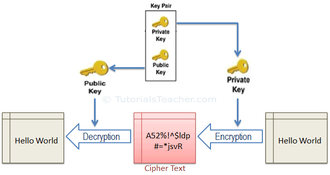
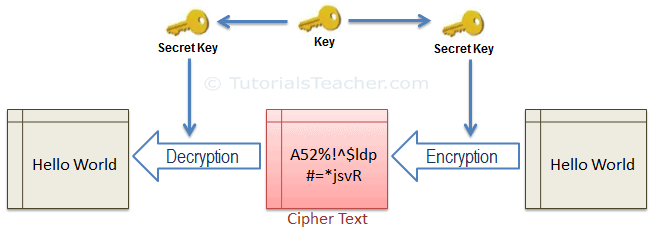
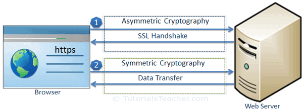
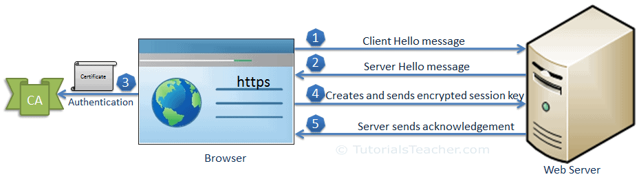
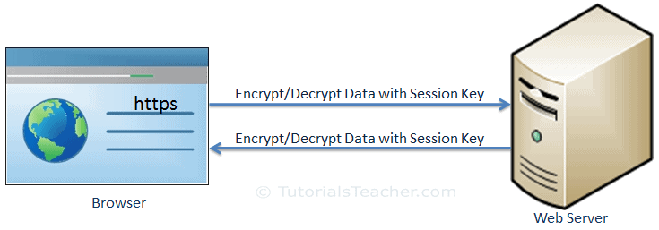

# **How SSL works?**

As you learned in the previous chapter, https uses SSL protocol to secure the communication by transferring encrypted data. Before going deeper, learn how SSL works.

SSL fundamentally works with the following concepts:

1. Asymmetric Cryptography
2. Symmetric Cryptography

## **Asymmetric Cryptography**

Asymmetric cryptography (also known as Asymmetric Encryption or Public Key Cryptography) uses a mathematically-related key pair to encrypt and decrypt data. In a key pair, one key is shared with anyone who is interested in a communication. This is called **Public Key**. The other key in the key pair is kept secret and is called **Private Key**.

Here, the keys referred to a mathematical value and were created using a mathematical algorithm which encrypts or decrypts the data.

In the asymmetric cryptography, the data can be signed with a private key, which can only be decrypted using the related public key in a pair.

SSL uses asymmetric cryptography to initiate the communication which is known as SSL handshake. Most commonly used asymmetric key encryption algorithms include EIGamal, RSA, DSA, Elliptic curve techniques and PKCS.

## **Symmetric Cryptography**

In the symmetric cryptography, there is only one key which encrypts and decrypts the data. Both sender and receiver should have this key, which is only known to them.

SSL uses symmetric cryptography using the session key after the initial handshake is done. The most widely used symmetric algorithms are AES-128, AES-192 and AES-256.

## **Data Transfer over SSL**

SSL protocol uses asymmetric and symmetric cryptography to transfer data securely. The following figure illustrates the steps of SSL communication:

As you can see in the above figure, SSL communication between the browser and the web server (or any other two systems) is mainly divided into two steps: the SSL handshake and the actual data transfer.

### **SSL Handshake**

The communication over SSL always begins with the SSL handshake. The SSL handshake is an asymmetric cryptography which allows the browser to verify the web server, get the public key and establish a secure connection before the beginning of the actual data transfer.

The following figure illustrates the steps involved in the SSL handshake:

Let's understand the above steps:

1. The client sends a "client hello" message. This includes the client's SSL version number, cipher settings, session-specific data and other information that the server needs to communicate with the client using SSL.
2. The server responds with a "server hello" message. This includes the server's SSL version number, cipher settings, session-specific data, an SSL certificate with a public key and other information that the client needs to communicate with the server over SSL.
3. The client verifies the server's SSL certificate from CA (Certificate Authority) and authenticates the server. If the authentication fails, then the client refuses the SSL connection and throws an exception. If the authentication succeeds, then proceed to step 4.
4. The client creates a session key, encrypts it with the server's public key and sends it to the server. If the server has requested client authentication (mostly in server to server communication), then the client sends his own certificate to the server.
5. The server decrypts the session key with its private key and sends the acknowledgement to the client encrypted with the session key.

Thus, at the end of the SSL handshake, both the client and the server have a valid session key which they will use to encrypt or decrypt actual data. The public key and the private key will not be used any more after this.

## **Actual Data Transfer**

The client and the server now use a shared session key to encrypt and decrypt actual data and transfer it. This is done using the same session key at both ends and so, it is a symmetric cryptography. The actual SSL data transfer uses symmetric cryptography because it is easy and takes less CUP consumption compared with the asymmetric cryptography.

Thus, SSL fundamentally works using asymmetric cryptography and symmetric cryptography. There are certain infrastructures involved in achieving SSL communication in real life, which are called Public Key Infrastructure.

## **Public Key Infrastructure**

The[ public key infrastructure (PKI)](https://en.wikipedia.org/wiki/Public_key_infrastructure) is a set of roles, policies, and procedures needed to create, manage, distribute, use, store, and revoke digital certificates and manage public key encryption.

PKI includes the following elements:

*   Certificate Authority: The authority that authenticates the identity of individuals, computers and other entities.
*   Registration Authority: A subordinate CA that issues a certificate on the behalf of root CA for specific uses.
*   SSL Certificate: The Data file that includes the public key and other information.
*   Certificate Management System: The system which stores, validates and revokes certificates.

## References

[https://www.tutorialsteacher.com/https/how-ssl-works](https://www.tutorialsteacher.com/https/how-ssl-works)
