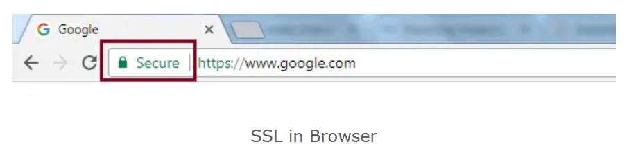
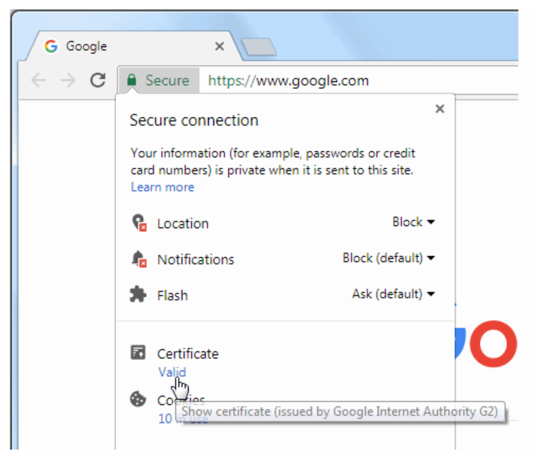
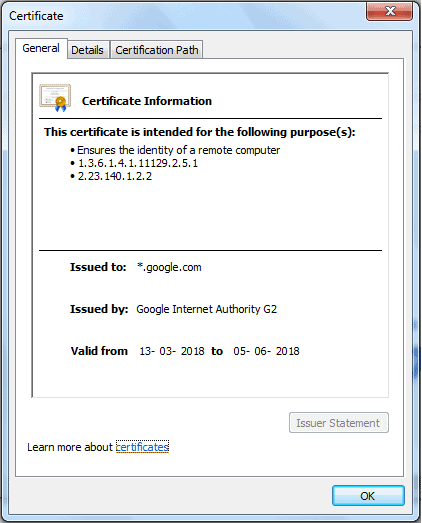
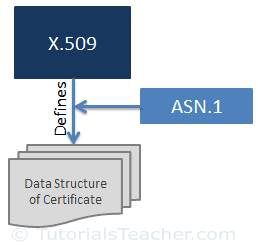

# **What is the SSL Certificate?**

The SSL certificate (also known as digital certificate) plays an important role in securing the communication between two systems.

The SSL certificate is a data file issued by the authorised Certificate Authority (CA). As you learned in the previous chapter, SSL uses asymmetric cryptography to establish an encrypted link between the two systems using a key pair (public key and private key). The SSL certificate contains the owner's public key and other details. The web server sends a public key to the browser through an SSL certificate and the browser verifies it and authenticates the web server using the SSL certificate.

You can open the certificate of any https website. For example, enter the url https://www.google.com in Google Chrome browser to check the SSL certificate of google.com. Any https website will have a padlock Secure in the addressbar, as shown below.

Click on the padlock symbol and click on Certificate, as shown below.

This will open the certificate as shown below.

As you can see, in the General tab, the certificate displays Issued to, Issued by and Valid from and to dates. The Details tab includes other information. 	 The Certificate Path tab includes information about all the intermediate certificates and the root CA certificate.

## **X.509**

[X.509](https://en.wikipedia.org/wiki/X.509) is a standard that defines the format of the digital certificate. SSL uses the X.509 format. In other words, SSL certificates are actually X.509 certificates.

X.509 uses a formal language called[ Abstract Syntax Notation One (ASN.1)](https://en.wikipedia.org/wiki/Abstract_Syntax_Notation_One) to express the certificate's data structure.

The SSL certificate in X.509 format includes the following information:

*   **Version:** The version number of the certificate data format as per X.509.
*   **Serial number:** Unique identifier of the certificate assigned by CA
*   **Public Key:** The owner's public key
*   **Subject:** Owner's name, address, country and domain name
*   **Issuer:** Name of the CA who issued the certificate
*   **Valid-From:** The date the certificate is valid from
*   **Valid-To:** The expiration date
*   **Signature Algorithm:** The algorithm used to create the signature
*   **Thumbprint:** The hash of the certificate
*   **Thumbprint Algorithm:** The algorithm used to create a hash of the certificate

## **Types of SSL Certificates**

There are different types of SSL certificates available today based on the **validation level** and the **number of domains they secure**. The encryption levels remain the same for all types of certificates but the validation levels and look and feels are different.

## **Types of SSL Certificates based on Validation Level**

Websites use SSL certificates to setup a trust level with their visitors and customers. Different businesses require to setup different levels of trust. For example, websites which collects user's important information need to transfer it securely. Financial institutions need to setup domain authenticity as well as data security. So, CA needs to validate the website owner's information based on the trust they want to setup. The following three types of certificates are based on the level of validation.

### **Domain Validated Certificates**

The Domain Validated (DV) certificate requires the lowest level validation because the main purpose of DV certificates is to make the secure communication between the domain's web server and browser. CA only verifies that the owner has a control over the domain.

### **Organization Validated Certificates**

The Organization Validated (OV) certificate requires a medium level validation where CA checks the rights of an organization to use the domain and also the organization's information. The OV certificate enhances the trust level of the organization and its domain.

### **Extended Validated Certificates**

The Extended Validated (EF) certificate requires a high-level validation where CA conducts rigorous background checks on the organization according to guidelines. This includes verification of the legal, physical and operational existence of the entity.

## **Types of SSL Certificates based on the Number of Domains they Secure**

The following certificates are based on the number of domains needs to be secured.

### **Single Domain Certificate**

The single domain certificate secures one fully qualified domain name. For example, a single domain certificate for www.example.com will not secure the communication for mail.example.com.

### **Wildcard SSL Certificate**

The wildcard SSL certificate secures an unlimited number of subdomains for a single domain. For example, a wildcard SSL certificate for example.com will also secure mail.example.com, blog.example.com etc.

### **Unified SSL Certificate /Multi-Domain SSL Certificate/SAN Certificate**

The unified SSL certificate secures up to 100 domains using the same certificate with the help of the SAN extension. It is especially designed to secure Microsoft Exchange and Office Communication environments.
