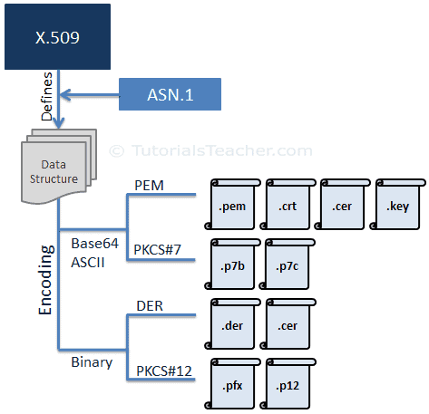

# **SSL Certificate Formats**

An SSL Certificate is essentially an X.509 certificate. X.509 is a standard that defines the structure of the certificate. It defines the data fields that should be included in the SSL certificate. X.509 uses a formal language called[ Abstract Syntax Notation One (ASN.1)](https://en.wikipedia.org/wiki/Abstract_Syntax_Notation_One) to express the certificate's data structure.

There are different formats of X.509 certificates such as PEM, DER, PKCS#7 and PKCS#12. PEM and PKCS#7 formats use Base64 ASCII encoding while DER and PKCS#12 use binary encoding. The certificate files have different extensions based on the format and encoding they use.

The following figure illustrates the X.509 Certificate's encoding formats and file extensions.

## **PEM Format**

Most CAs (Certificate Authority) provide certificates in PEM format in Base64 ASCII encoded files. The certificate file types can be .pem, .crt, .cer, or .key. The .pem file can include the server certificate, the intermediate certificate and the private key in a single file. The server certificate and intermediate certificate can also be in a separate .crt or .cer file. The private key can be in a .key file.

PEM files use ASCII encoding, so you can open them in any text editor such as notepad, MS word etc. Each certificate in the PEM file is contained between the ---- BEGIN CERTIFICATE---- and ----END CERTIFICATE---- statements. The private key is contained between the ---- BEGIN RSA PRIVATE KEY----- and -----END RSA PRIVATE KEY----- statements. The CSR is contained between the -----BEGIN CERTIFICATE REQUEST----- and -----END CERTIFICATE REQUEST----- statements.

## **PKCS#7 Format**

The PKCS#7 format is a Cryptographic Message Syntax Standard. The PKCS#7 certificate uses Base64 ASCII encoding with file extension .p7b or .p7c. Only certificates can be stored in this format, not private keys. The P7B certificates are contained between the "-----BEGIN PKCS7-----" and "-----END PKCS7-----" statements.

## **DER Format**

The DER certificates are in binary form, contained in .der or .cer files. These certificates are mainly used in Java-based web servers.

## **PKCS#12 Format**

The PKCS#12 certificates are in binary form, contained in .pfx or .p12 files.

The PKCS#12 can store the server certificate, the intermediate certificate and the private key in a single .pfx file with password protection. These certificates are mainly used on the Windows platform.
